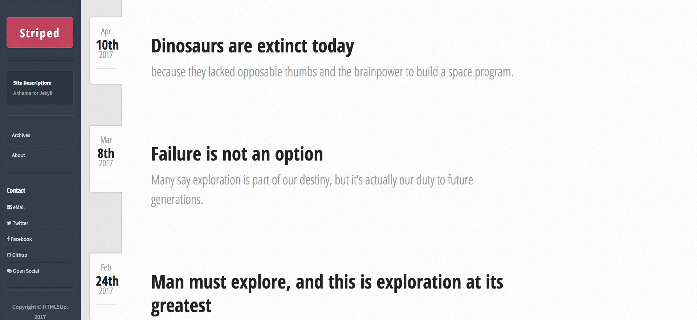
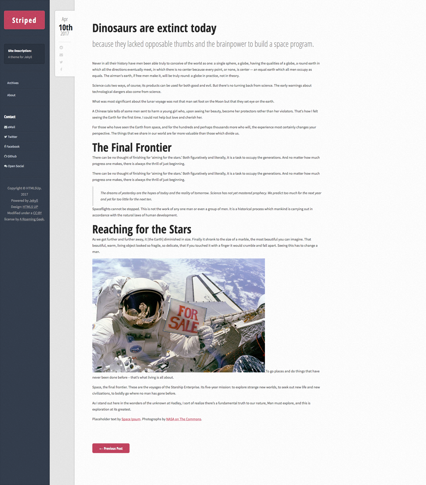
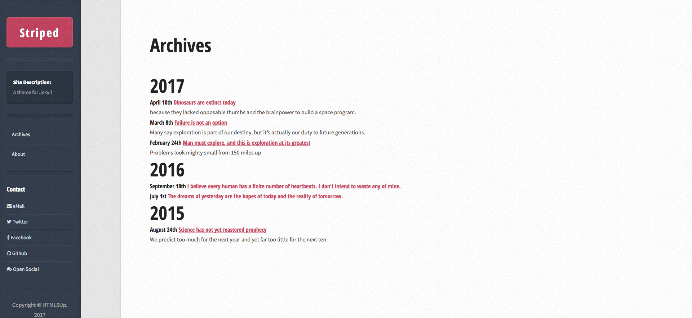

# Striped by HTML5Up
The HTML5 Up "[Striped](https://html5up.net/striped)" theme, converted to Jekyll (http://jekyllrb.com).  
Single index file from the HTML5Up template, broken down in to easier to manage chunks for Jekyll.    
sidebar.html  
nav.html 
 
Main page:  
  
Single post:  
   
Archives page:  
  

See it in action at [G not C](http://gnotc.com):  

ReadMe from original template:  
Striped by HTML5 UP
html5up.net | @ajlkn
Free for personal and commercial use under the [CCA 3.0](https://creativecommons.org/licenses/by/3.0/) license (html5up.net/license)

And here's a new one: Striped, which features a clean, minimalistic design, styling for
all basic page elements (including blockquotes, tables and lists), a repositionable
sidebar (left or right), and HTML5/CSS3 code designed for quick and easy customization
(see code comments for details).

(* = Not included)

Feedback, bug reports, and comments are not only welcome, but strongly encouraged :)

AJ
aj@lkn.io | @ajlkn

Credits:

	Demo Images:
		Unsplash (unsplash.com)

	Icons:
		Font Awesome (fortawesome.github.com/Font-Awesome)

	Other:
		jQuery (jquery.com)
		html5shiv.js (@afarkas @jdalton @jon_neal @rem)
		CSS3 Pie (css3pie.com)
		Respond.js (j.mp/respondjs)
		Skel (skel.io)